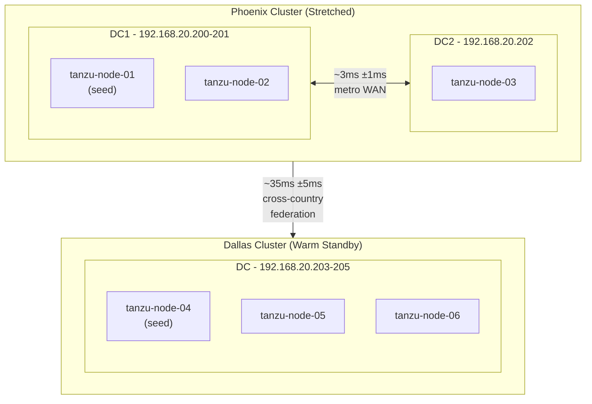

# Tanzu RabbitMQ Ansible Lab

Automated deployment of a Tanzu RabbitMQ lab environment with:

- **Phoenix Cluster**: 3-node stretched cluster across 2 datacenters (metro WAN simulation)
- **Dallas Cluster**: 3-node normal cluster configured as warm standby
- **Network Latency**: Simulated metro (~3ms) and cross-country (~35ms) latency using tc/netem
- **Federation**: Dallas automatically replicates from Phoenix

## Architecture



## Prerequisites

- Python 3.9+ with Ansible
- vSphere 8 environment
- RHEL 9 template with cloud-init and OVF properties enabled
  - See [Building the Template](docs/packer/README.md) (automated with Packer)
  - Or [Manual Template Build](docs/template-manual-build.md) (step-by-step guide)
- Broadcom Tanzu RabbitMQ entitlement
- Red Hat subscription (for RHEL repos)

## Quick Start

### 1. Install Ansible dependencies

```bash
pip install ansible
ansible-galaxy collection install -r requirements.yml
```

### 2. Configure vault password

```bash
echo "your-vault-password" > .vault_pass
chmod 600 .vault_pass
```

### 3. Create secrets file

```bash
cp inventory/group_vars/all/vault.yml.example inventory/group_vars/all/vault.yml
ansible-vault encrypt inventory/group_vars/all/vault.yml
ansible-vault edit inventory/group_vars/all/vault.yml
```

Fill in your credentials (see `vault.yml.example` for required variables).

### 4. Customize environment (optional)

Edit `inventory/group_vars/all/main.yml` to match your environment:
- vSphere infrastructure names
- Network settings (interface, gateway, DNS)
- Latency simulation values

Edit `inventory/hosts.yml` to adjust:
- Node hostnames and IP addresses
- Cluster membership

### 5. Deploy

```bash
ansible-playbook site.yml
```

## Playbooks

| Playbook | Description |
|----------|-------------|
| `site.yml` | Master playbook - runs everything |
| `playbooks/provision.yml` | Create VMs in vSphere |
| `playbooks/install_rmq.yml` | Install Tanzu RabbitMQ |
| `playbooks/cluster_rmq.yml` | Form Phoenix and Dallas clusters |
| `playbooks/configure_latency.yml` | Setup network latency simulation |
| `playbooks/configure_warm_standby.yml` | Configure federation/warm standby |
| `playbooks/health_check.yml` | Verify cluster health |
| `playbooks/destroy.yml` | Delete all lab VMs |

### Examples

```bash
# Full deployment
ansible-playbook site.yml

# Skip VM provisioning (VMs already exist)
ansible-playbook site.yml --skip-tags provision

# Run specific playbook
ansible-playbook playbooks/cluster_rmq.yml

# Health check
ansible-playbook playbooks/health_check.yml

# Tear down environment
ansible-playbook playbooks/destroy.yml
```

## Configuration

### Non-secret settings (`inventory/group_vars/all/main.yml`)

```yaml
vsphere:
  datacenter: "tanzu-datacenter"
  cluster: "tanzu-cluster"
  datastore: "vsanDatastore"
  folder: "rabbitmq-lab"
  template: "rhel9-6-template"
  network: "dvpg-mgmt-network"

network:
  interface: "ens33"
  gateway: "192.168.20.1"
  dns_servers: ["192.168.20.1", "8.8.8.8"]
  domain: "tanzu.lab"

latency:
  metro:
    delay_ms: 3
    jitter_ms: 1
  cross_country:
    delay_ms: 35
    jitter_ms: 5
```

### Secrets (`inventory/group_vars/all/vault.yml`)

See `vault.yml.example` for the template. Required variables:
- vCenter credentials
- Broadcom repository credentials
- Red Hat subscription
- VM and RabbitMQ passwords

## Management UIs

After deployment:

| Cluster | URL | Credentials |
|---------|-----|-------------|
| Phoenix | http://192.168.20.200:15672 | admin / (your vault password) |
| Dallas  | http://192.168.20.203:15672 | admin / (your vault password) |

## Inventory Structure

```
nodes
├── stretched_cluster (Phoenix)
│   ├── phoenix_dc1
│   │   ├── tanzu-node-01 (seed)
│   │   └── tanzu-node-02
│   └── phoenix_dc2
│       └── tanzu-node-03
└── normal_cluster (Dallas)
    ├── tanzu-node-04 (seed)
    ├── tanzu-node-05
    └── tanzu-node-06
```

## Testing Federation

1. Log into Phoenix management UI (http://192.168.20.200:15672)
2. Create an exchange or queue
3. Log into Dallas management UI (http://192.168.20.203:15672)
4. Verify the exchange/queue appears via federation
5. Check **Admin → Federation Status** for link health

## Troubleshooting

### Health check
```bash
ansible-playbook playbooks/health_check.yml
```

### Manual cluster status
```bash
ansible tanzu-node-01 -m command -a "rabbitmqctl cluster_status"
ansible tanzu-node-04 -m command -a "rabbitmqctl cluster_status"
```

### Verify latency simulation
```bash
# Metro latency (~3ms)
ansible tanzu-node-01 -m command -a "ping -c 3 tanzu-node-03"

# Cross-country latency (~35ms)
ansible tanzu-node-01 -m command -a "ping -c 3 tanzu-node-04"
```

### Reset admin password
```bash
ansible tanzu-node-01 -m command -a "rabbitmqctl change_password admin newpassword"
ansible tanzu-node-04 -m command -a "rabbitmqctl change_password admin newpassword"
```

### Re-run specific stage
```bash
# Re-cluster after fixing issues
ansible-playbook playbooks/cluster_rmq.yml

# Re-configure federation
ansible-playbook playbooks/configure_warm_standby.yml
```

## Customization

To adapt for your environment:

1. **Different IP range**: Edit `inventory/hosts.yml`
2. **Different vSphere names**: Edit `inventory/group_vars/all/main.yml`
3. **Different latency values**: Edit `latency.*` in `main.yml`
4. **Different cluster sizes**: Modify inventory groups and adjust playbooks
5. **Skip latency simulation**: Remove `configure_latency.yml` from `site.yml`

## File Structure

```
.
├── ansible.cfg                 # Ansible configuration
├── site.yml                    # Master playbook
├── requirements.yml            # Ansible collection dependencies
├── inventory/
│   ├── hosts.yml              # Node inventory
│   └── group_vars/all/
│       ├── main.yml           # Non-secret configuration
│       ├── vault.yml          # Encrypted secrets (not in git)
│       └── vault.yml.example  # Template for secrets
├── playbooks/
│   ├── provision.yml          # VM provisioning
│   ├── install_rmq.yml        # RabbitMQ installation
│   ├── cluster_rmq.yml        # Cluster formation
│   ├── configure_latency.yml  # Network latency
│   ├── configure_warm_standby.yml  # Federation setup
│   ├── health_check.yml       # Environment verification
│   └── destroy.yml            # Cleanup
├── templates/
│   └── userdata.yaml.j2       # Cloud-init template
└── docs/
    ├── template-manual-build.md  # Manual template build guide
    └── packer/                   # Automated template build
        ├── README.md
        ├── rhel9-template.pkr.hcl
        ├── http/ks.cfg
        └── scripts/seal.sh
```
