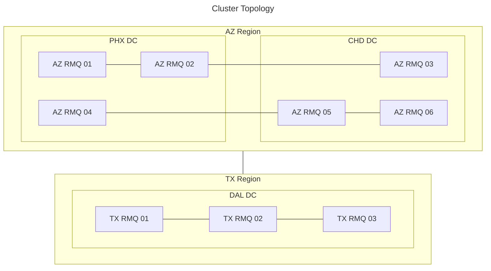
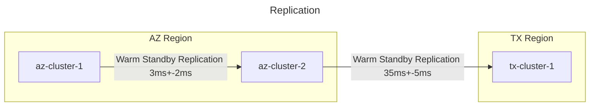

# Tanzu RabbitMQ Ansible Lab

Automated deployment of a Tanzu RabbitMQ multi-region lab environment with:

- **3 Clusters** across 2 regions (Arizona + Texas), each with 3 nodes spanning 2 datacenters
- **Network Latency Simulation**: Metro (~3ms) within regions, cross-region (~35ms) between Arizona and Texas
- **Warm Standby DR**: AZ-Cluster-1 replicates to AZ-Cluster-2 (regional standby) and TX-Cluster-1 (cross-region DR)
- **9 Nodes Total**: 6 in Arizona (Phoenix + Chandler DCs), 3 in Texas (Dallas DCs)

## Architecture



## Prerequisites

- Python 3.9+ with Ansible
- vSphere 8 environment
- RHEL 9 template with cloud-init and OVF properties enabled
  - See [Building the Template](docs/packer/README.md) (automated with Packer)
  - Or [Manual Template Build](docs/template-manual-build.md) (step-by-step guide)
- Broadcom Tanzu RabbitMQ entitlement
- Red Hat subscription (for RHEL repos)

## Quick Start

### 1. Install Ansible dependencies

```bash
pip install ansible
ansible-galaxy collection install -r requirements.yml
```

### 2. Configure vault password

```bash
echo "your-vault-password" > .vault_pass
chmod 600 .vault_pass
```

### 3. Create secrets file

```bash
cp inventory/group_vars/all/vault.yml.example inventory/group_vars/all/vault.yml
ansible-vault encrypt inventory/group_vars/all/vault.yml
ansible-vault edit inventory/group_vars/all/vault.yml
```

Fill in your credentials (see `vault.yml.example` for required variables).

### 4. Customize environment (optional)

Edit `inventory/group_vars/all/main.yml` to match your environment:
- vSphere infrastructure names
- Network settings (interface, gateway, DNS)
- Latency simulation values

Edit `inventory/hosts.yml` to adjust:
- Node hostnames and IP addresses
- Cluster membership and DC assignments

### 5. Deploy

```bash
ansible-playbook site.yml
```

## Playbooks

| Playbook | Description |
|----------|-------------|
| `site.yml` | Master playbook - runs everything |
| `playbooks/provision.yml` | Create VMs in vSphere |
| `playbooks/install_rmq.yml` | Install Tanzu RabbitMQ |
| `playbooks/cluster_rmq.yml` | Form 3 RabbitMQ clusters |
| `playbooks/configure_latency.yml` | Setup network latency simulation |
| `playbooks/configure_warm_standby.yml` | Configure warm standby replication DR |
| `playbooks/health_check.yml` | Verify cluster health |
| `playbooks/install_perftest.yml` | Install performance test tools |
| `playbooks/destroy.yml` | Delete all lab VMs |

### Examples

```bash
# Full deployment
ansible-playbook site.yml

# Skip VM provisioning (VMs already exist)
ansible-playbook site.yml --skip-tags provision

# Run specific playbook
ansible-playbook playbooks/cluster_rmq.yml

# Health check
ansible-playbook playbooks/health_check.yml

# Tear down environment
ansible-playbook playbooks/destroy.yml
```

## Configuration

### Non-secret settings (`inventory/group_vars/all/main.yml`)

```yaml
vsphere:
  datacenter: "tanzu-datacenter"
  cluster: "tanzu-cluster"
  datastore: "vsanDatastore"
  folder: "rabbitmq-lab"
  template: "rhel9-6-template"
  network: "dvpg-mgmt-network"

network:
  interface: "ens33"
  gateway: "192.168.20.1"
  dns_servers: ["192.168.20.1", "8.8.8.8"]
  domain: "tanzu.lab"

latency:
  metro:
    delay_ms: 3
    jitter_ms: 1
  cross_region:
    delay_ms: 35
    jitter_ms: 5
```

### Secrets (`inventory/group_vars/all/vault.yml`)

See `vault.yml.example` for the template. Required variables:
- vCenter credentials
- Broadcom repository credentials
- Red Hat subscription
- VM and RabbitMQ passwords

## Management UIs

After deployment:

| Cluster | URL | Credentials |
|---------|-----|-------------|
| AZ-Cluster-1 | http://192.168.20.200:15672 | admin / (your vault password) |
| AZ-Cluster-2 | http://192.168.20.203:15672 | admin / (your vault password) |
| TX-Cluster-1 | http://192.168.20.206:15672 | admin / (your vault password) |
| TX-Cluster-2 | http://192.168.20.209:15672 | admin / (your vault password) |

## Inventory Structure

```
nodes
├── arizona (Primary Region)
│   ├── az_cluster_1 (1 Phoenix + 2 Chandler)
│   │   ├── az-rmq-01 (Phoenix, seed)
│   │   ├── az-rmq-02 (Chandler)
│   │   └── az-rmq-03 (Chandler)
│   └── az_cluster_2 (2 Phoenix + 1 Chandler)
│       ├── az-rmq-04 (Phoenix, seed)
│       ├── az-rmq-05 (Phoenix)
│       └── az-rmq-06 (Chandler)
├── texas (DR Region)
│   └── tx_cluster_1 (1 Dallas1 + 2 Dallas2)
│   │   ├── tx-rmq-01 (Dallas1, seed)
│   │   ├── tx-rmq-02 (Dallas2)
│   │   └── tx-rmq-03 (Dallas2)
│   └── tx_cluster_1 (2 Dallas1 + 1 Dallas2)
│       ├── tx-rmq-04 (Dallas1, seed)
│       ├── tx-rmq-05 (Dallas1)
│       └── tx-rmq-06 (Dallas2)
└── DC groups (for latency rules)
    ├── phoenix_dc
    ├── chandler_dc
    ├── dallas1_dc
    └── dallas2_dc
```

## Testing Warm Standby Replication

1. Log into AZ-Cluster-1 management UI (http://192.168.20.200:15672)
2. Create a queue and publish messages
3. Log into AZ-Cluster-2 (http://192.168.20.203:15672),  TX-Cluster-1 (http://192.168.20.206:15672), or TX-Cluster-2 (http://192.168.20.209:15672)
4. Verify the queue and messages appear via warm standby replication
5. Check replication status: `rabbitmqctl standby_replication_status`

## Troubleshooting

### Health check
```bash
ansible-playbook playbooks/health_check.yml
```

### Manual cluster status
```bash
ansible az-rmq-01 -m command -a "rabbitmqctl cluster_status"
ansible az-rmq-04 -m command -a "rabbitmqctl cluster_status"
ansible tx-rmq-01 -m command -a "rabbitmqctl cluster_status"
```

### Verify latency simulation
```bash
# Metro latency within Arizona (~3ms)
ansible az-rmq-01 -m command -a "ping -c 3 az-rmq-02"

# Cross-region latency Arizona → Texas (~35ms)
ansible az-rmq-01 -m command -a "ping -c 3 tx-rmq-01"
```

### Reset admin password
```bash
# Reset on all cluster seeds
ansible az-rmq-01,az-rmq-04,tx-rmq-01 -m command -a "rabbitmqctl change_password admin newpassword"
```

### Re-run specific stage
```bash
# Re-cluster after fixing issues
ansible-playbook playbooks/cluster_rmq.yml

# Re-configure federation
ansible-playbook playbooks/configure_warm_standby.yml
```

## Performance Testing

A test framework is included for validating throughput, latency, and replication under load. See [perf-tests/README.md](perf-tests/README.md) for full details.

```bash
# Install test tools
ansible-playbook playbooks/install_perftest.yml

# Run a baseline test against AZ-Cluster-1
./perf-tests/run-test.sh baseline --host 192.168.20.200

# Compare results
./perf-tests/compare-results.sh
```

## Customization

To adapt for your environment:

1. **Different IP range**: Edit `inventory/hosts.yml`
2. **Different vSphere names**: Edit `inventory/group_vars/all/main.yml`
3. **Different latency values**: Edit `latency.*` in `main.yml`
4. **Different cluster sizes**: Modify inventory groups and adjust playbooks
5. **Skip latency simulation**: Remove `configure_latency.yml` from `site.yml`

## Production Sizing

For guidance on running warm standby replication at high message rates (trading-adjacent and financial services workloads), see [High-Throughput Warm Standby Sizing Guide](docs/high-throughput-sizing.md). Covers fan-out architecture constraints, disk/network/WAN sizing, replication lag and RPO analysis, and operational procedures for multi-downstream failover.

## Future Enhancements

- **Shovel plugin**: Add shovel support alongside federation for fine-grained, per-queue replication between clusters. Compare shovel vs federation for DR use cases.
- **Stream server-side filtering**: Add perf-test scenarios for stream consumers with server-side filtering to measure filtering performance under load.

## File Structure

```
.
├── ansible.cfg                 # Ansible configuration
├── site.yml                    # Master playbook
├── requirements.yml            # Ansible collection dependencies
├── inventory/
│   ├── hosts.yml              # 9-node inventory (3 clusters, 4 DCs)
│   └── group_vars/all/
│       ├── main.yml           # Non-secret configuration
│       ├── vault.yml          # Encrypted secrets (not in git)
│       └── vault.yml.example  # Template for secrets
├── playbooks/
│   ├── provision.yml          # VM provisioning
│   ├── install_rmq.yml        # RabbitMQ installation
│   ├── cluster_rmq.yml        # Cluster formation (3 clusters)
│   ├── configure_latency.yml  # Network latency (metro + cross-region)
│   ├── configure_warm_standby.yml  # Warm standby replication DR
│   ├── health_check.yml       # Environment verification
│   ├── install_perftest.yml   # Performance test tools
│   └── destroy.yml            # Cleanup
├── perf-tests/
│   ├── README.md              # Performance testing guide
│   ├── run-test.sh            # Test runner script
│   ├── compare-results.sh     # Results comparison
│   ├── scenarios/             # Test scenario definitions
│   ├── results/               # Test output (git-ignored)
│   └── tools/                 # Downloaded JARs (git-ignored)
├── templates/
│   └── userdata.yaml.j2       # Cloud-init template
└── docs/
    ├── template-manual-build.md  # Manual template build guide
    └── packer/                   # Automated template build
        ├── README.md
        ├── rhel9-template.pkr.hcl
        ├── http/ks.cfg
        └── scripts/seal.sh
```
